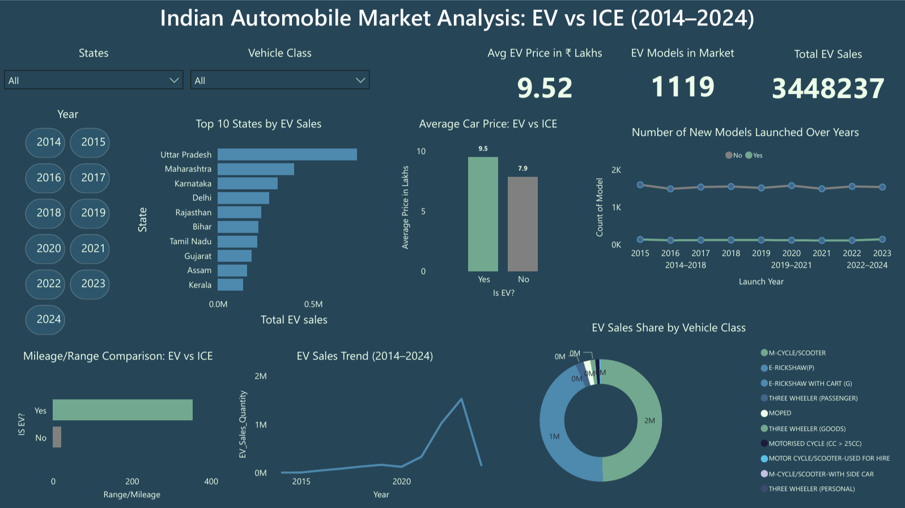
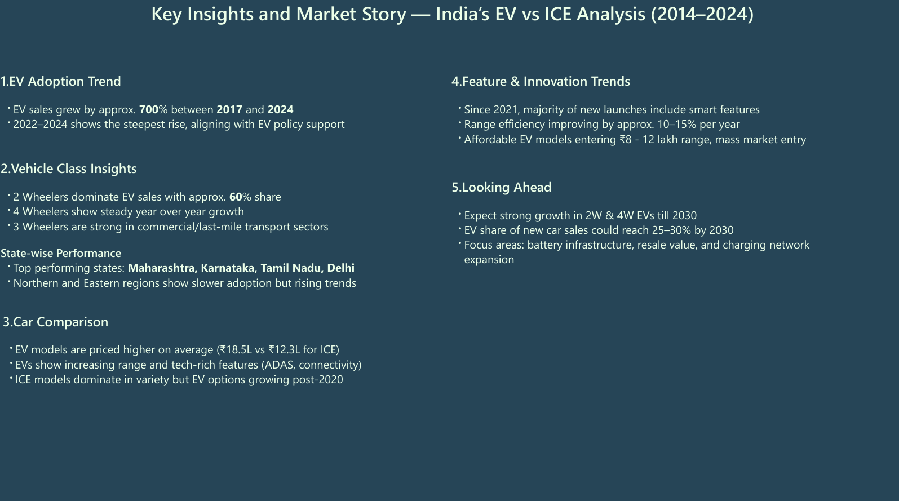

# ⚡ EV Sales Analysis in India (2014–2024)

###  Overview
This project analyzes the **growth and trends of Electric Vehicles (EVs)** in the Indian automobile market using real-world data.  
It compares **EV and ICE (Internal Combustion Engine)** car models, explores **sales performance**, and highlights **emerging market insights** using **Python** and **Power BI**.

---

###  Objectives
- Compare **EV vs ICE** models in terms of price, range, and availability.  
- Explore **EV sales trends** across states and vehicle classes from 2014 to 2024.  
- Identify **top-performing states**, **growth periods**, and **market share** of each vehicle type.  
- Visualize insights with an interactive **Power BI dashboard**.

---

###  Datasets Used
1. **Car Models Dataset** – Contains Indian car models (EV + ICE) with specifications:
   - Price, Mileage/Range, Type (EV or ICE), Year, Brand, etc.  
2. **EV Sales Dataset** – Records EV sales by:
   - Year, Vehicle Class (2W, 3W, 4W, Bus), State, and Quantity  

Source: Public automotive datasets and aggregated EV sales reports (cleaned & transformed).

---

###  Data Cleaning & Preparation (Python)
Performed using **Pandas** and **NumPy**:
- Removed missing and inconsistent values  
- Renamed columns for clarity (e.g., `Ex_Showroom_Price_(₹_Lakhs)` → `Price`)  
- Converted text-based prices into numeric ranges  
- Standardized categorical labels (EV/ICE)  
- Merged datasets for Power BI analysis  
- Exported cleaned data:

---

###  Dashboard Highlights (Power BI)

#### Key Visuals:
- EV Sales Growth (2014–2024)  
- Top 10 States by EV Sales  
- EV Sales by Vehicle Class  
- Average Price Comparison (EV vs ICE)  
- Range vs Price Correlation  
- Models Launched per Year  

#### KPIs:
-  **Total EV Sales**  
-  **EV Models in Market**  
-  **Average EV Price (₹ Lakhs)**  
-  **Years of Data Coverage**

---

###  Insights & Findings

- EV sales grew by **~700% between 2017 and 2024**  
- **2-Wheelers** dominate the market (~60% of total EV sales)  
- **Top states:** Maharashtra, Karnataka, Delhi, and Tamil Nadu  
- EV models are priced higher on average (**₹18.5L vs ₹12.3L for ICE**)  
- Post-2020: Sharp rise in new EV launches and improved range efficiency  

---

###  Tools & Technologies
| Tool | Purpose |
|------|----------|
|  Python (Pandas, NumPy, Matplotlib) | Data Cleaning & EDA 
|  Power BI | Dashboard & Storytelling 
|  Excel / CSV | Data Sources 

---

###  Learnings
- Data wrangling & feature extraction using Python  
- Designing clean, interactive dashboards in Power BI  
- Performing comparative analysis (EV vs ICE)  
- Storytelling through data visualization  
